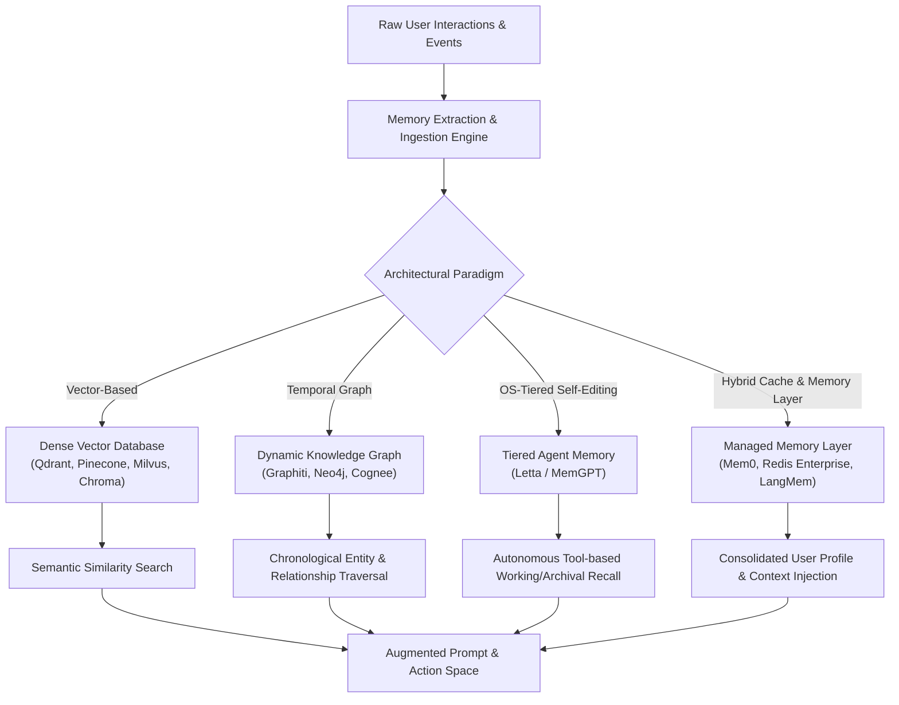

  

  
  
  
  
  
  
  
  

---

# 🧠 Awesome Long-Term Memory Platform

> **The Definitive Ecosystem Guide to AI Agent Memory, Persistent Context, Temporal Knowledge Graphs, Vector Databases & Cross-Session Recall**

*Last updated: September 2026*

This repository tracks the most impactful **SaaS platforms** and **open-source projects** dedicated to **Long-Term Memory (LTM) for Artificial Intelligence**. These systems grant autonomous agents, LLM pipelines, and conversational interfaces persistent state far beyond standard context window limits—extracting facts, tracking user preferences across sessions, maintaining temporal knowledge graphs, and updating self-editing memory blocks.

---

## 📑 Table of Contents

- [🧠 What is Long-Term Memory in AI?](#-what-is-long-term-memory-in-ai)
- [☁️ SaaS & Hosted Long-Term Memory Platforms](#️-saas--hosted-long-term-memory-platforms)
- [🔓 Open-Source Memory Frameworks & Vector Engines](#-open-source-memory-frameworks--vector-engines)
- [🏛️ Architectural Memory Paradigms](#️-architectural-memory-paradigms)
- [🛠️ How to Choose the Right Platform](#️-how-to-choose-the-right-platform)
- [🤝 How to Contribute](#-how-to-contribute)
- [📈 Star History](#-star-history)
- [💖 Support & Sponsorship](#-support--sponsorship)
- [⚖️ Disclaimer](#️-disclaimer)

---

## 🧠 What is Long-Term Memory in AI?

Standard Large Language Models (LLMs) operate statelessly: once a session or context window closes, conversational history and learned user preferences vanish. **Long-Term Memory (LTM)** platforms introduce an external cognitive layer enabling:

- 🔄 **Cross-Session Recall**: Recognizing recurring users, remembering explicit preferences, and past milestones.
- 🕒 **Temporal Awareness**: Tracking how facts evolve over time (e.g., *"Alice lived in Seattle in 2023, but moved to Tokyo in 2025"*).
- 🗃️ **Tiered Storage**: Emulating human memory architectures—combining working memory (context window), short-term episodic logs, and deep archival semantic memory.
- ⚡ **Sub-second Retrieval**: Pairing dense vector embeddings with hybrid lexical filtering and structured graph queries.

---

## ☁️ SaaS & Hosted Long-Term Memory Platforms

> 💡 **Market Outlook & Industry Dynamics:** The global AI agent memory, context infrastructure, and vector storage market represents an estimated **$3.8 Billion to $5.2 Billion market in 2026**, projected to surpass **$16.5 Billion by 2030** (CAGR ~28.5%). The sector is currently **moderately to highly fragmented**—characterized by rapid architectural divergence across specialized memory layers (Mem0, Letta, Zep), scalable cloud vector engines (Pinecone, Qdrant, Weaviate, Milvus/Zilliz), knowledge graph backends (Neo4j), and enterprise cache titans (Redis). No single winner-take-all monopoly has emerged yet, making multi-tier hybrid architectures the prevailing industry choice.

The following table compares leading hosted and managed long-term memory platforms, sorted in **descending order by company size (valuation / revenue)**:

| Platform | Primary Focus & Capabilities | Company Size (Valuation / Revenue) | Starting Tier Pricing | Free Tier / Trial Limits |
| :--- | :--- | :--- | :--- | :--- |
| **[Redis Enterprise](https://redis.io/)** | Ultra-fast in-memory vector database, semantic caching, and sub-millisecond session & agent memory store | **Valuation: ~$4.0B+** *(Total Raised: $347M+, ARR: >$150M)* | **$5.00/month** *(Fixed plan)* or **$0.0076/hour** *(Flexible pay-as-you-go)* | **Free forever 30 MB database** *(1 fixed database, 30MB RAM, up to 30 concurrent connections)* |
| **[Neo4j AuraDB](https://neo4j.com/cloud/platform/aura-graph-database/)** | Native graph database cloud service powering enterprise knowledge graphs and relationship-based agent reasoning | **Valuation: ~$2.0B+** *(Total Raised: $582M+, ARR: >$150M)* | **$65.00/month** *(AuraDB Professional, billed at $0.09/hour)* | **Free forever AuraDB Free instance** *(1 database, up to 200,000 nodes and 400,000 relationships)* |
| **[Astra DB (DataStax)](https://www.datastax.com/products/datastax-astra)** | Serverless vector database built on Apache Cassandra for planetary-scale RAG and multi-tenant agent memory | **Valuation: ~$1.6B+** *(Total Raised: $345M+, ARR: >$100M)* | **$0.25/GB/month** storage + **$0.00015/1K read/write ops** *(Pay-as-you-go)* | **$25.00 free credit monthly recurring forever** *(Worth ~40M write ops, 80M read ops, or 100GB storage)* |
| **[Pinecone](https://www.pinecone.io/)** | Fully managed serverless vector database engine optimized for fast semantic similarity search and AI agent recall | **Valuation: ~$750M** *(Total Raised: $138M, Series B)* | **$0.33 per 1M read units (RU)** + **$2.00 per 1M write units (WU)** + **$0.33/GB/mo** | **Free forever Starter plan** *(1 project, 1 serverless index, up to 100,000 vectors / 2GB storage)* |
| **[Zilliz Cloud](https://zilliz.com/cloud)** | Cloud-native managed Milvus vector database service built for billions of high-dimensional embeddings | **Valuation: ~$600M** *(Total Raised: $113M, Series B)* | **$65.00/month** *(Starter cluster)* or **$0.000085/CU-hour** *(Serverless pay-as-you-go)* | **Free forever tier** *(Up to 2 collections, 1M vector limit, 5GB storage, $100/mo credit value)* |
| **[Weaviate Cloud](https://weaviate.io/)** | AI-native vector and hybrid search platform with built-in multi-modal embedding modules and metadata filtering | **Valuation: ~$220M** *(Total Raised: $67M, Series B)* | **$25.00/month** *(Serverless Standard base tier)* | **14-day free trial Sandbox cluster** *(1 cluster, up to 500,000 vectors, no credit card required)* |
| **[Qdrant Cloud](https://qdrant.tech/)** | Managed Rust-based vector search engine with payload-based filtering, quantization, and high concurrency | **Valuation: ~$170M** *(Total Raised: $38M, Series A)* | **$25.00/month** *(0.5 GB RAM cluster)* or **$0.035/hour** *(Pay-as-you-go)* | **Free forever 1GB RAM cluster** *(1 cluster, 0.5 vCPU, 4GB disk, capacity for ~up to 1M vectors)* |
| **[Mem0 Platform](https://mem0.ai/)** | Managed multi-tenant memory layer for AI agents; automatically extracts, merges, and recalls user facts & preferences | **Valuation: ~$90M** *(Total Raised: $24.5M, YC S24 & Series A)* | **$19.00/month** *(Starter plan: 50,000 add requests + 5,000 retrieval requests/month)* | **Free forever Hobby plan** *(10,000 add requests + 1,000 retrieval requests/month, 1 user)* |
| **[Letta Cloud](https://www.letta.com/)** | Stateful agent runtime (from UC Berkeley MemGPT) where agents manage their own tiered memory, identity, and tools | **Valuation: ~$70M** *(Total Raised: $10M, Seed by Felicis)* | **$20.00/month** *(Pro plan: 20 stateful agents; or Developer API $20/mo base + $0.10/agent)* | **Free forever Cloud Developer tier** *(Up to 10 active agents, BYOK LLM API key access)* |
| **[Zep Cloud](https://www.getzep.com/)** | Long-term memory platform utilizing temporal knowledge graphs to track evolving facts and context across time | **Valuation: ~$18M** *(Total Raised: $2.3M, YC & Seed)* | **$125.00/month** *(Flex plan: 50,000 credits/month, 5 projects, 600 requests/min)* | **Free forever Community plan** *(10,000 credits/month, 2 projects, 1 MCP server seat, 5 entity types)* |
| **[Supermemory](https://supermemory.ai/)** | Universal context engine and memory infrastructure for agents and personal knowledge bases with MCP protocol support | **Valuation: ~$10M** *(Total Raised: $3M, Seed)* | **$19.00/month** *(Pro plan: 5,000 vector memory queries + expanded bookmark capacity)* | **Free forever plan** *(100 memory items/bookmarks, 100 vector queries/month, MCP server access)* |
| **[Graphlit](https://www.graphlit.com/)** | Content ingestion and knowledge graph service transforming multi-source documents into agent-ready context | **Valuation: ~$5M** *(Seed / Angel funded)* | **$49.00/month** *(Starter plan: 10,000 ingested items + 100,000 LLM tokens/month)* | **Free forever plan** *(100 credits/month, up to 1GB content storage, 1 project)* |

---

## 🔓 Open-Source Memory Frameworks & Vector Engines

The open-source ecosystem is vibrant, offering complete data ownership and local execution capabilities for security-conscious teams. Below is the curated list of top open-source projects, sorted in **descending order by GitHub star count**:

1. **[Redis](https://github.com/redis/redis)**   
   ⚡ The world's fastest in-memory data store with native vector similarity search, secondary indexing, semantic caching, and pub/sub message brokering for high-throughput AI agent memory.

2. **[Mem0](https://github.com/mem0ai/mem0)**   
   🧠 The self-improving memory layer for AI agents and assistants. Provides a framework-agnostic Python/JS API to extract, consolidate, update, and retrieve user facts and preferences across sessions using hybrid vector and graph approaches.

3. **[Milvus](https://github.com/milvus-io/milvus)**   
   🚀 Distributed, cloud-native open-source vector database built specifically for massive-scale similarity search, handling billions of embeddings with multiple indexing algorithms (HNSW, IVF, SCaNN).

4. **[FAISS (Facebook AI Similarity Search)](https://github.com/facebookresearch/faiss)**   
   🔬 Meta's industry-standard C++ and Python library for ultra-efficient dense vector clustering, indexing, and GPU-accelerated nearest-neighbor search.

5. **[Microsoft GraphRAG](https://github.com/microsoft/graphrag)**   
   🕸️ Modular, graph-based Retrieval-Augmented Generation pipeline that extracts structured entity knowledge graphs and communities from raw text to give LLMs global dataset memory and contextual synthesis.

6. **[Qdrant](https://github.com/qdrant/qdrant)**   
   🦀 High-performance, Rust-native vector database designed for production similarity search with extensive payload filtering, scalar/product quantization, and memory-mapped storage.

7. **[Graphiti (Zep)](https://github.com/getzep/graphiti)**   
   ⏳ Real-time, open-source temporal knowledge graph engine for AI agents. Encodes dynamic facts alongside temporal validity windows, allowing agents to understand chronological state changes.

8. **[Cognee](https://github.com/topoteretes/cognee)**   
   🧩 Open-source AI memory platform turning unstructured conversational and document streams into deterministic knowledge graphs and vector spaces for autonomous agents.

9. **[Supermemory](https://github.com/supermemoryai/supermemory)**   
   📦 Fast, local-first memory and context engine featuring Model Context Protocol (MCP) servers, personal knowledge management, and browser extension integrations.

10. **[Chroma](https://github.com/chroma-core/chroma)**   
    🎯 Open-source, developer-friendly embedding database designed to simplify building LLM apps, local prototyping, and agentic RAG memory with minimal configuration.

11. **[Letta (formerly MemGPT)](https://github.com/letta-ai/letta)**   
    🤖 Operating-system-style framework for stateful agents. Features tiered memory tiers (working context, archival store, and recall logs) where agents inspect, edit, and consolidate their own persistent memory.

12. **[pgvector](https://github.com/pgvector/pgvector)**   
    🐘 Open-source vector similarity search extension for PostgreSQL. Stores embeddings alongside traditional relational tables with HNSW and IVFFlat indexing, eliminating the need for a separate database.

13. **[Weaviate](https://github.com/weaviate/weaviate)**   
    🔍 Open-source, cloud-native vector search engine with native hybrid search (BM25 + vector), multi-modal model integrations, and modular graph-like inverted indices.

14. **[txtai](https://github.com/neuml/txtai)**   
    💡 All-in-one embeddings database and AI workflow engine unifying semantic vector search, relational storage, and sparse graph structures in a single lightweight framework.

15. **[R2R (SciPhi)](https://github.com/SciPhi-AI/R2R)**   
    🛡️ Production-grade open-source RAG engine and contextual memory API featuring multi-user permissioning, temporal document tracking, hybrid search, and automated knowledge graphs.

16. **[Vespa](https://github.com/vespa-engine/vespa)**   
    🏢 Industrial-grade engine for low-latency vector search, lexical matching, structured data evaluation, and ML model inference at massive query per second (QPS) scales.

17. **[CozoDB](https://github.com/cozodb/cozo)**   
    🦛 Relational, graph, and vector database powered by Datalog queries—architected as the deterministic "hippocampus" for advanced AI cognitive agent systems.

18. **[LangMem](https://github.com/langchain-ai/langmem)**   
    🦜 Specialized memory library by LangChain designed to extract, maintain, and inject long-term user memories into stateful LangGraph agents and multi-agent workflows.

---

## 🏛️ Architectural Memory Paradigms

Understanding how each platform approaches memory design is critical for selecting the right architecture:

### 1. 📐 Vector-Centric Memory (Similarity Search)
- **Examples:** Pinecone, Qdrant, Milvus, Weaviate, pgvector, Chroma.
- **How it works:** Conversational snippets are chunked and converted into vector embeddings. When a new prompt arrives, cosine/dot-product similarity retrieves the top-K nearest chunks.
- **Strengths:** High throughput, scale to billions of records, excellent for unstructured text.
- **Limitations:** Suffers from temporal blindness (struggles to know if fact B superseded fact A).

### 2. 🕸️ Temporal Knowledge Graph Memory
- **Examples:** Graphiti (Zep), Microsoft GraphRAG, Neo4j, Cognee.
- **How it works:** Entities and relationships are extracted into graph nodes and directed edges with associated timestamps and validity intervals (`valid_at`, `invalidated_at`).
- **Strengths:** Resolves contradictions, preserves chronological order, models multi-hop reasoning.
- **Limitations:** Higher computational overhead and latency during ingestion.

### 3. 🖥️ OS-Tiered Self-Editing Memory
- **Examples:** Letta (MemGPT).
- **How it works:** Treats the LLM context window as RAM, with external databases as disk/virtual memory. The agent has dedicated tools (`core_memory_append`, `archival_memory_search`) to update its own personality, goals, and facts.
- **Strengths:** True agent autonomy, stateful self-improvement over time.
- **Limitations:** Demands capable frontier models capable of reliable tool calling.

---

## 🛠️ How to Choose the Right Platform

| Use Case | Recommended Platform(s) | Key Rationale |
| :--- | :--- | :--- |
| **Drop-in User Memory for Chatbots** | **Mem0**, **Supermemory** | Easiest zero-config API to store user preferences and facts across sessions. |
| **Complex Reasoning & Evolving Facts** | **Zep (Graphiti)**, **Cognee** | Temporal graph engine prevents stale facts from causing agent hallucinations. |
| **Autonomous Stateful Agents** | **Letta (MemGPT)** | Agents actively manage and curate their own internal state. |
| **Massive-Scale Vector Infrastructure** | **Milvus**, **Pinecone**, **Qdrant** | Purpose-built for multi-billion vector scale with enterprise SLAs. |
| **Unified Relational + Memory Stack** | **pgvector**, **Redis Enterprise** | Reuses existing Postgres or Redis database infrastructure with zero data duplication. |
| **Privacy-First / On-Premise Deployments** | **Qdrant**, **Chroma**, **FAISS**, **CozoDB** | Fully open-source, self-hosted, air-gapped deployments with zero cloud dependencies. |

---

## 🤝 How to Contribute

We welcome community contributions from developers, researchers, and maintainers!

1. 🍴 **Fork** the repository: [ishandutta2007/Awesome-Long-Term-Memory-Platform](https://github.com/ishandutta2007/Awesome-Long-Term-Memory-Platform).
2. 🌿 **Create a Branch**: `git checkout -b feature/add-new-memory-platform`.
3. 📝 **Add Your Entry**:
   - For **SaaS**: Include product name, URL, primary focus, company size, starting tier price, and free tier limits.
   - For **Open-Source**: Include repo link, star badge (`style=social&color=white`), and concise description. Ensure the list remains sorted descending by stars.
4. 🚀 **Submit a Pull Request**: Provide a brief summary of the project and why it belongs in the ecosystem.

Explore the master list of curated resources at [Awesome-Awesome-Awesome](https://github.com/ishandutta2007/Awesome-Awesome-Awesome).

---

## 📈 Star History

---

## 💖 Support & Sponsorship

Thank you for exploring the **Awesome Long-Term Memory Platform** repository! If this curated landscape helps you build better, more persistent AI systems, please consider supporting the project:

- ⭐ **Star this repository** to help other AI engineers and researchers discover it!
- 🍴 **Fork and share** with your team or community on social platforms and Discord.
- ☕ **Sponsor the Maintainer / Buy a Coffee:** You can support continuous maintenance, benchmarking, and updates via the **[GitHub Sponsors Dashboard](https://github.com/sponsors/ishandutta2007)**.

  

---

## ⚖️ Disclaimer

- This is a **community-curated index** for informational and educational purposes. Inclusion does not constitute a formal commercial endorsement.
- Long-term memory platforms store user prompts, chat transcripts, and personal data. Implementations must comply with local privacy regulations (e.g., GDPR, CCPA, HIPAA). Proper encryption, access control, and data retention policies remain the responsibility of system operators.

---

  <b>Crafted with 🧠 for AI engineers, agent builders, and persistent context researchers.</b>

